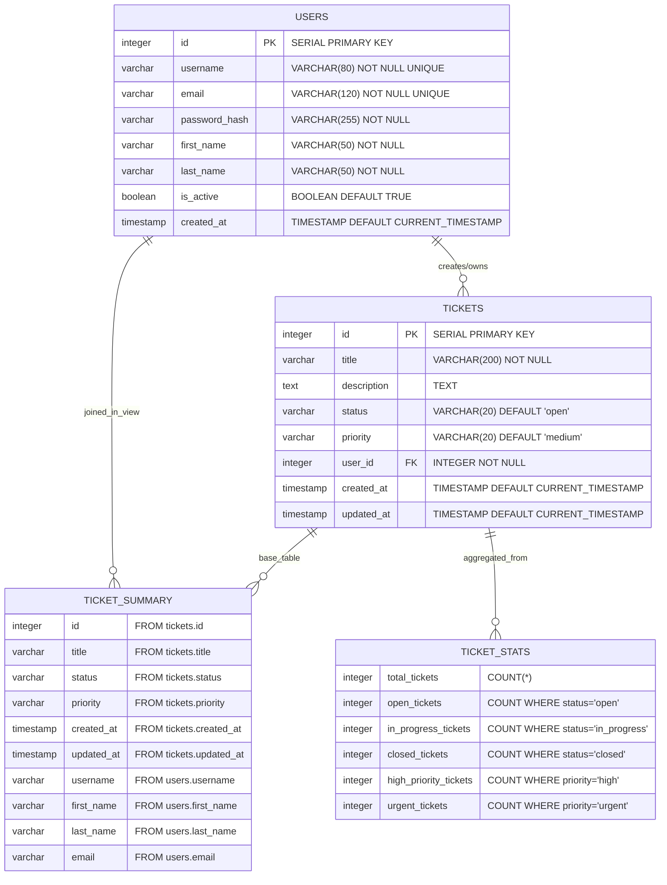

# Entity Relationship Diagram - IGD Support System

## Database Tables and Relationships

## Relationship Details

### Primary Relationships

1. **USERS → TICKETS** (One-to-Many)
   - **Relationship Type**: One user can have multiple tickets
   - **Foreign Key**: `tickets.user_id` references `users.id`
   - **Cascade Rule**: ON DELETE CASCADE (when a user is deleted, all their tickets are also deleted)

### Views and Virtual Relationships

2. **TICKET_SUMMARY View**
   - Combines data from USERS and TICKETS tables
   - Provides a denormalized view for common queries
   - Includes user information with ticket details

3. **TICKET_STATS View**
   - Aggregates ticket data for dashboard statistics
   - Provides counts by status and priority

## Constraints and Business Rules

### USERS Table Constraints
- **Username**: Must be at least 3 characters long, unique
- **Email**: Must match email format pattern, unique
- **Names**: First and last names must be at least 1 character

### TICKETS Table Constraints
- **Status**: Must be one of: 'open', 'in_progress', 'closed', 'cancelled'
- **Priority**: Must be one of: 'low', 'medium', 'high', 'urgent'
- **Title**: Must be at least 1 character long
- **User Association**: Must reference a valid user (NOT NULL foreign key)

## Database Indexes

### Performance Optimization Indexes

**USERS Table:**
- `idx_users_username` - Single column index on username
- `idx_users_email` - Single column index on email
- `idx_users_created_at` - Single column index on created_at
- `idx_users_active` - Single column index on is_active

**TICKETS Table:**
- `idx_tickets_user_id` - Single column index on user_id
- `idx_tickets_status` - Single column index on status
- `idx_tickets_priority` - Single column index on priority
- `idx_tickets_created_at` - Single column index on created_at
- `idx_tickets_updated_at` - Single column index on updated_at

**Composite Indexes for Common Queries:**
- `idx_tickets_user_status` - (user_id, status)
- `idx_tickets_user_priority` - (user_id, priority)
- `idx_tickets_status_priority` - (status, priority)
- `idx_tickets_user_created` - (user_id, created_at DESC)

## Database Functions and Triggers

### Automated Timestamp Updates
- **Function**: `update_updated_at_column()` - Automatically updates the `updated_at` field
- **Trigger**: `update_tickets_updated_at` - Fires before UPDATE on tickets table

### Custom Functions
- **`get_user_ticket_count(user_id)`** - Returns ticket counts by status for a specific user

## Sample Data Structure

The database includes sample data:
- 4 sample users (including admin)
- 8 sample tickets with various statuses and priorities
- Demonstrates the user-ticket relationships in practice

## Key Design Decisions

1. **Cascading Deletes**: When a user is deleted, all their tickets are automatically deleted
2. **Automatic Timestamps**: Tickets automatically track creation and update times
3. **Data Integrity**: Comprehensive constraints ensure data quality
4. **Performance**: Strategic indexing for common query patterns
5. **Reporting Views**: Pre-built views for dashboard and reporting needs
